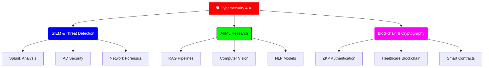

<div align="center">
  
</div>

<h1 align="center">🛡️ SECURITY ANALYST & AI RESEARCHER 🛡️</h1>

<div align="center">
  
  [](https://www.linkedin.com/in/raj-mehta-b5b684273/)
  [](mailto:770rajmehta@gmail.com)
  [](https://github.com/Its-your-rj)
  [](tel:+917984413301)

</div>

---

<div align="center">
  <h3>🔥 CURRENT MISSION 🔥</h3>
  <a href="https://git.io/typing-svg">
    
  </a>
</div>

---

## 👨‍💻 About Me

I'm a **Computer Science & Engineering** student at **Nirma University** (CGPA: 8.6/10) with a **minor in Cybersecurity**, passionate about **AI-driven security**, **threat detection**, and **cutting-edge research**. Currently working as a **Security Analyst Intern at SharkStriker Inc.**, where I specialize in SIEM engineering, Active Directory security, and threat hunting.

> *"In cybersecurity, you are only as strong as your weakest detection rule."* 🎯
>
> *"The future of security is not just reactive — it's predictive, proactive, and AI-powered."* 🤖

---

## 💼 Professional Experience

### 🔐 **Security Analyst Intern** | SharkStriker Inc.
**May 2025 – Jul 2025** | On-site

- ⚡ Configured **Splunk Universal Forwarders** across Ubuntu, Linux, and Windows for centralized log analysis
- 🎯 Simulated **Active Directory attacks** using Atomic Red Team and analyzed attack footprints
- 🛡️ Integrated **Microsoft 365** with Streigo platform for threat detection and alert generation
- 🌐 Deployed **Sophos XG Firewall** and conducted network security testing
- 🔍 Explored **Living Off The Land Binaries (LOLBins)** and analyzed detections
- 🕵️ Performed **web application penetration testing** on DVWA using Burp Suite
- 🔑 Conducted **Active Directory enumeration**, credential harvesting, and IOC analysis

### 🌟 **Open Source Contributor** | GirlScript Summer of Code (GSSoC)
**May 2024 – Aug 2024** | Remote

- 🐛 Reported and fixed bugs across multiple projects including VigyBag, BlogZen, EduWeb
- 🔧 Contributed to code reviews and suggested optimizations
- 📚 Enhanced skills in GitHub workflows, bug reporting, and collaborative development

---

## 🏆 Achievements & Certifications

<div align="center">

| 🎖️ Certification | 🏅 Achievement | 🌟 Recognition |
| :---: | :---: | :---: |
|  |  |  |
|  |  |  |
|  |  |  |

</div>

### 📜 Complete Certification List

- ✅ **Google Cybersecurity Professional Certificate** (Coursera 2024-2025)
  - Foundations of Cybersecurity
  - Play It Safe: Manage Security Risks
  - Connect and Protect: Networks and Network Security
  - Tools of the Trade: Linux and SQL
- ✅ **Google AI Essentials** (Coursera 2024)
- ✅ **Microsoft & LinkedIn Career Essentials in Generative AI** (2023)
- ✅ **Full Stack Web Development** - Dr. Angela Yu (Udemy 2024)
- ✅ **Code to Learn** - Google (2018)
- ✅ **HackNUthon 3.0** Participation (2023)

---

## 📚 Research & Publications

### 🔬 **Published Research Papers**

1. **"Blockchain-based Patient Recommendation System for Smart Healthcare"**
   - 📍 IEEE International Conference on E-health Networking (HealthCom 2024)
   - 🏥 Healthcare + Blockchain + AI

2. **"A Novel Zero-Knowledge Proof-based Verification and Authentication Protocol (ZKPVA) for Web Security"**
   - 📍 ICTIS 2025, Bangkok, Thailand
   - 🔐 Cryptography + Web Security

3. **"Farming 4.0: Machine Learning-Powered Crop Recommendations for Implementing Optimal Farming Techniques"**
   - 📍 CML 2025, Sikkim Manipal University
   - 🌾 AI + Agriculture (SCOPUS-indexed Springer LNNS)

### 💰 **Funded Research Project**

**SecureHealth: A Blockchain Powered Framework for Monitoring Patients Health Parameter**
- 💵 **Funding:** ₹35,000 by Nirma University
- 🔬 **Mentors:** Dr. Smita Agrawal, Dr. Parita Oza
- 👥 **Team Size:** 4 members
- 📝 **Status:** Patent Applied

---

## 🚀 Featured Projects

### 1️⃣ **Real-Time Human Motion Detection Surveillance System**
[](#)

- 🎥 Real-time human detection using **MobileNet SSD** trained on COCO dataset
- ☁️ Integrated with **Azure Blob Storage** for secure video uploads
- 📱 **Twilio SMS notifications** with video URLs upon detection
- 🌐 Built **Flask API** for system control with asynchronous threading
- 🛠️ **Tech Stack:** Python, OpenCV, FFmpeg, Azure, ML

[🔗 Check It Out →](https://github.com/Its-your-rj)

### 2️⃣ **Smart Document Assistant**
[](#)

- 📄 Processes PDF, DOCX, TXT files using **Streamlit**
- 🧠 Implemented **RAG pipeline** with semantic embeddings
- 🤖 Deployed **RoBERTa** (QA) and **BART** (summarization) models
- 💾 Vector storage with **ChromaDB** and **Sentence-Transformers**
- 🛠️ **Tech Stack:** Python, LangChain, Hugging Face, PyTorch

[🔗 Check It Out →](https://github.com/Its-your-rj)

### 3️⃣ **Cryptography Toolkit**
[](#)

- 🔐 Comprehensive web-based cryptographic resource
- 🔑 Implements **Caesar, Vigenère, RSA, Diffie-Hellman, ZKP**
- 🎓 Features cryptanalysis insights and attack strategies
- 🧪 Interactive simulation tools (under development)
- 🛠️ **Tech Stack:** Python, Web Technologies

[🔗 Check It Out →](https://github.com/Its-your-rj)

### 4️⃣ **Networking Essentials**
[](#)

- 🌐 Comprehensive networking concepts repository
- 🔧 **VLANs, subnetting, dynamic routing** implementations
- 📡 **IoT device configuration** and socket programming
- 🛠️ **Tools:** Cisco Packet Tracer, Wireshark

[🔗 Check It Out →](https://github.com/Its-your-rj)

### 5️⃣ **NLP & Deep Learning Models**
[](#)

- 🖼️ **Image Classification** (CIFAR-10), **Digit Recognition** (MNIST)
- 🎨 **GANs** for image generation
- 🔤 **Seq2Seq** for machine translation
- 📝 **RNNs** for image captioning
- 🛠️ **Tech Stack:** PyTorch, NumPy, CNNs, Autoencoders

[🔗 Check It Out →](https://github.com/Its-your-rj)

---

## 🛠️ Technology Arsenal

### 💻 Programming & Core Skills
<div align="center">
  
  
</div>

### 🔐 Cybersecurity & Networking
<div align="center">
  
  
  
  
  
  
</div>

### 🤖 AI/ML & Data Science
<div align="center">
  
  
  
  
</div>

### ☁️ Cloud & Databases
<div align="center">
  
  
</div>

### 🌐 Web Development
<div align="center">
  
</div>

---

## 📊 Competitive Programming

<div align="center">

| Platform | Profile | Stats |
| :--- | :--- | :--- |
| 💻 **LeetCode** | [770rajmehta](https://leetcode.com/u/770rajmehta/) | 500+ Problems Solved |
| ⭐ **HackerRank** | Profile | 5★ C++ • 3★ Python |
| 🎯 **CodeForces** | Profile | Active Competitive Programmer |
| 🍴 **CodeChef** | Profile | Regular Contests |
| 📊 **Kaggle** | [rajhmehta](https://www.kaggle.com/rajhmehta) | ML Competitions & Datasets |

</div>

**Achievements:**
- ✅ Solved **500+ DSA problems** across platforms
- ✅ Completed **Striver SDE Sheet**
- ✅ Active participant in competitive programming contests

---

## 🎓 Education

**🏛️ Nirma University** | *Bachelor of Technology in Computer Science and Engineering*  
📅 June 2022 – Present | 📈 **CGPA: 8.6/10**  
🔒 **Minor:** Cybersecurity

### 📚 Relevant Coursework

<table>
<tr>
<td>

**Core CS**
- Data Structures & Algorithms
- Design & Analysis of Algorithms
- Object-Oriented Programming
- Operating Systems (Linux)
- Computer Architecture

</td>
<td>

**Security & Networks**
- Cybersecurity
- Information & Network Security
- Digital Forensics
- Computer Networks
- Hardware Designing

</td>
<td>

**AI/ML & Data**
- Machine Learning
- Artificial Intelligence
- Data Analysis & Visualization
- Database Management Systems
- Windows & Linux Administration

</td>
</tr>
</table>

---

## 📊 GitHub Statistics

<div align="center">
  
  
</div>

<div align="center">
  <h3>⚡ Contribution Streak ⚡</h3>
  
</div>

<div align="center">
  <h3>🏆 GitHub Trophies 🏆</h3>
  
</div>

---

## 🎯 Focus Areas



---

## 💡 Current Focus

- 🔍 **SIEM Engineering:** Advanced log analysis and threat hunting with Splunk
- 🎯 **Active Directory Security:** Attack simulation and defense strategies
- 🧠 **RAG Applications:** Building intelligent document analysis systems
- 🔐 **Cryptography Research:** Zero-Knowledge Proofs and authentication protocols
- 🤖 **AI Security:** Integrating ML models for automated threat detection
- 🌐 **Network Forensics:** Deep packet inspection and traffic analysis

---

## 🌟 Philosophy

<div align="center">
  <table>
    <tr>
      <td align="center">
        <b>🔍 PROACTIVE HUNTING</b><br/>
        <i>Hunt threats before they hunt you</i>
      </td>
      <td align="center">
        <b>🤖 AI-DRIVEN DEFENSE</b><br/>
        <i>Automate detection and response</i>
      </td>
      <td align="center">
        <b>📚 CONTINUOUS LEARNING</b><br/>
        <i>Stay ahead of evolving threats</i>
      </td>
      <td align="center">
        <b>🌍 ETHICAL SECURITY</b><br/>
        <i>Protect, don't exploit</i>
      </td>
    </tr>
  </table>
</div>

---

## 🛡️ Security Disclaimer

```diff
!  EDUCATIONAL & DEFENSIVE SECURITY RESEARCH  !
===============================================
|                                             |
|  All tools, techniques, and code shared     |
|  are strictly for EDUCATIONAL purposes      |
|  and DEFENSIVE cybersecurity operations.    |
|                                             |
-  Unauthorized offensive operations are      |
-  strictly prohibited and unethical.         |
|                                             |
+  Ethical security research encouraged.      |
+  Use knowledge responsibly.                 |
===============================================
```

---

## 📫 Let's Connect!

<div align="center">

[](https://www.linkedin.com/in/raj-mehta-b5b684273/)
[](mailto:770rajmehta@gmail.com)
[](https://leetcode.com/u/770rajmehta/)
[](https://www.kaggle.com/rajhmehta)

</div>

<div align="center">
  <p><b>👁️ Profile Views</b></p>
  
</div>

<div align="center">
  
</div>

---

<div align="center">
  <i>⭐ Star my repositories if you find them useful!</i><br/>
  <i>🤝 Open to collaboration on cybersecurity and AI projects</i>
</div>
